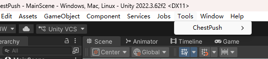
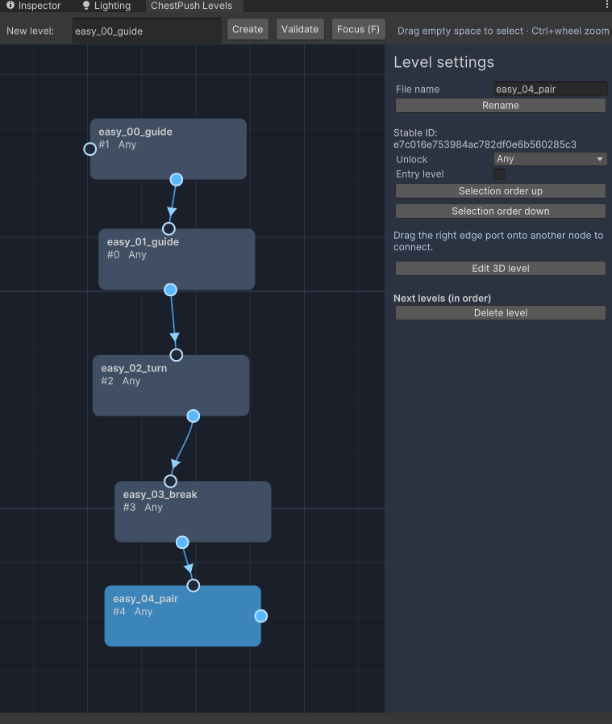
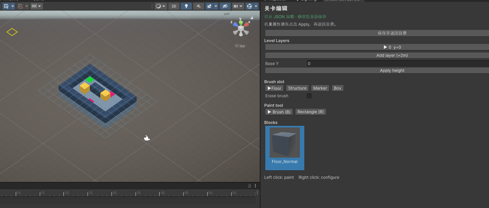

# ChestPush

基于 Unity 2022.3 URP 的 3D 推箱子项目。运行时使用单一主场景，从 JSON 构建关卡；关卡目录图与 3D 关卡编辑器通过 Unity Editor 使用。

## 关卡编辑器快速上手

### 1. 打开关卡目录

在 Unity 菜单中选择 `Tools > ChestPush > Level Editor`。目录图用于创建、整理和连接关卡节点。

### 2. 创建并整理关卡

在目录图中输入关卡文件名（例如 `easy_00_guide`）创建节点。选中节点后可设置入口、解锁条件和关卡顺序；从节点输出端口拖到另一个节点的输入端口即可建立连接。目录操作会自动保存。

### 3. 绘制 3D 关卡

选中节点并点击 `Edit 3D level`，进入 Scene 视图编辑模式，编辑器窗口会切换为 Palette。选择层和方块后，在 Scene 视图左键放置或擦除；按 `B` 切换单格画笔，按 `R` 切换矩形工具。右键可选择格子并编辑机关属性。完成后点击 `保存并返回目录`。

### 4. 检查关卡数据

使用 `Tools > ChestPush > Validate Project` 检查关卡数据和 Addressables 引用。关卡数据结构与完整编辑器操作说明见[关卡数据文档](Docs/ScriptModules/LevelData.md)和[关卡编辑器文档](Docs/ScriptModules/LevelEditor.md)。

## 文档索引

- [脚本模块索引](Docs/ScriptModules/README.md)：模块职责、依赖、场景挂载、输入、事件、存档和风险。
- [关卡数据](Docs/ScriptModules/LevelData.md)
- [格子规则](Docs/ScriptModules/GridRules.md)
- [关卡流程](Docs/ScriptModules/GameFlow.md)
- [关卡编辑器](Docs/ScriptModules/LevelEditor.md)

开发协作、文档维护和验证约定见 [AGENTS.md](AGENTS.md)。
